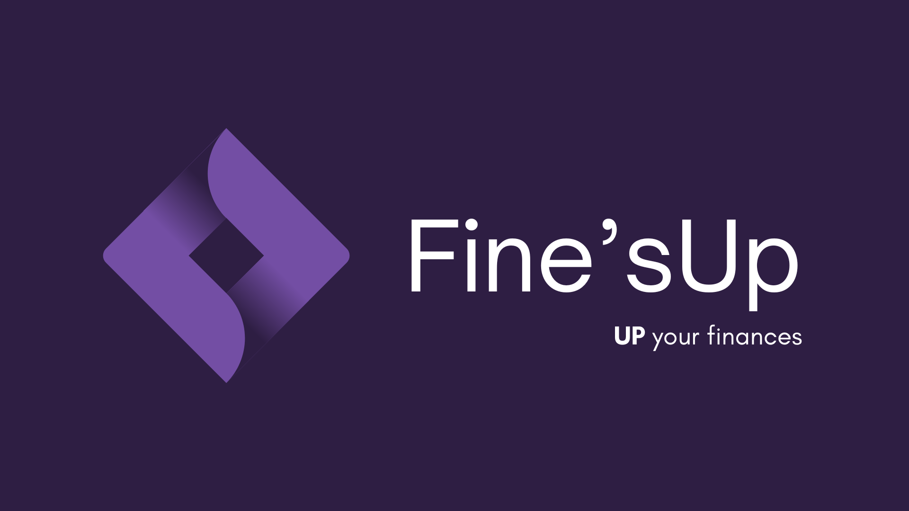

# Fine'sUp

Fine'sUp é um projeto que tem como objetivo promover a gestão e educação financeira para os usuários. O projeto oferece ferramentas e conteúdo para ajudar as pessoas a planejar, controlar e melhorar suas finanças pessoais. O Fine'sUp visa aumentar sua confiança, segurança e qualidade de vida por meio de uma gestão inteligente e eficaz.

---

## 📝 [Documentação](./documentation)

Aqui, você encontrará documentos essenciais que fornecem informações sobre a visão, escopo e requisitos do nosso projeto. Esses documentos são fundamentais para entender como o Fine'sUp busca promover a gestão e a educação financeira.

- [Visão e Escopo](./documentation/Documento%20de%20Visão%20e%20Escopo%20-%20PI%201.pdf)
- [Requisitos](./documentation/Documento%20de%20Requisitos%20-%20PI%201.pdf)
- [Banco de Dados](./documentation/database)
  - [Modelo Conceitual](./documentation/database/DER.pdf)
  - [Modelo Relacional](./documentation/database/Diagrama%20Relacional.pdf)

---

## 🏗 Protótipo

Aqui apresentamos o protóripo de alta fidelidade do Fine'sUp! Esta é uma prévia do futuro da nossa plataforma de gestão financeira e educação. Ele oferece uma visão das funcionalidades incríveis nas quais estamos trabalhando para ajudá-lo a controlar suas finanças.

### O que esperar?

Nosso protótipo está em desenvolvimento e foi projetado para proporcionar uma compreensão básica de como o Fine'sUp será em termos de aparência e funcionalidade. Aqui está o que você pode explorar nesta segunda versão:

1. Painel de Controle 📊

    Dê uma primeira olhada no painel de controle do Fine'sUp, onde você terá uma visão geral de sua situação financeira. Veja sua renda, despesas, metas de economia e muito mais em um piscar de olhos.

1. Acompanhamento de Despesas 💸

    Experimente nosso recurso preliminar de acompanhamento de despesas. Adicione suas despesas diárias, categorize-as e veja como elas afetam seu orçamento geral.

1. Definição de Metas 🎯

    Dê uma olhada na seção de definição de metas, onde você pode começar a estabelecer suas metas financeiras e acompanhar seu progresso.

1. Gráficos 📈

    Veja como os gráficos podem ajudá-lo a entender melhor sua situação financeira. Explore os diferentes tipos de gráficos que o Fine'sUp oferece para ajudá-lo a visualizar seus dados.

1. Controle de lançamentos 📝

    Teste o nosso recurso preliminar de controle de lançamentos. Adicione seus lançamentos, vincule a uma categoria,fixe-o repetindo em um determinado periodo e em uma determinada frequência e veja como eles afetam seu orçamento geral.

1. Controle de orçamento 📊

    Experimente nosso recurso preliminar de controle de orçamento. Adicione seus orçamentos, vincule a uma categoria e administre seus gastos nele.

1. Calculadoras de juros 🧮

    Veja como as calculadoras de juros podem ajudá-lo a calcular valores de rendimento a longo e curto prazo. Explore as calculadoras de juros simples e compostos que o Fine'sUp oferece para ajudá-lo a visualizar seus dados.

### Como acessar?

Basta clicar [aqui](https://www.figma.com/proto/aABYOzhc6SB5WGDJnLFXYO/Fine'sup?node-id=285-723&starting-point-node-id=285%3A723&mode=design&t=SuVWBsSgr50rBphO-1) e experimentar! 🌟
